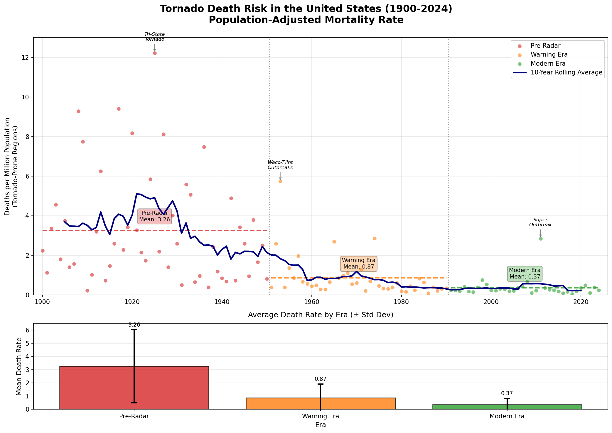

+++
title = "Tornado Death Risk in the United States: A 124-Year Analysis"
date = 2025-12-27
description = "An analysis of population-adjusted tornado mortality rates from 1900-2024, showing an 88.8% reduction in death risk through technological advances."

[taxonomies]
tags = ["data-analysis", "meteorology", "public-safety", "visualization"]
+++

Tornado deaths in the United States have declined dramatically over the past 124 years. When adjusted for population growth in tornado-prone regions, the mortality rate has dropped by 88.8% from the pre-radar era (1900-1950) to the modern era (1991-2024). This analysis examines how technological advances in weather prediction and warning systems have transformed tornado safety.

## Three Eras of Tornado Safety

The data reveals three distinct periods in tornado mortality:

### Pre-Radar Era (1900-1950)
- **Mean death rate:** 3.26 deaths per million population
- **Total deaths:** 10,553
- **Characteristics:** No advance warning systems, high variability in annual deaths

The deadliest single event during this period was the 1925 Tri-State Tornado, which killed 695 people across Missouri, Illinois, and Indiana [web:3]. Without radar or structured warning systems, communities had no advance notice of approaching tornadoes.

### Warning Era (1951-1990)
- **Mean death rate:** 0.87 deaths per million population  
- **Total deaths:** 3,864
- **73% reduction** from Pre-Radar era

This era began with the introduction of weather radar in the 1950s [web:5]. The 1953 Waco and Flint tornado outbreaks marked the last major catastrophic events before warning systems became widespread. The establishment of the National Weather Service's tornado warning program in 1952 represented a turning point in public safety [web:5].

### Modern Era (1991-2024)
- **Mean death rate:** 0.37 deaths per million population
- **Total deaths:** 2,332  
- **57% reduction** from Warning Era, **89% reduction** from Pre-Radar era

Advances in Doppler radar, improved forecasting models, and widespread communication through mobile devices have further reduced casualties [web:5]. The 2011 Super Outbreak remains an outlier, but even this catastrophic event resulted in a lower population-adjusted death rate (2.85 per million) compared to historical standards.

## Key Insights

### Dramatic Risk Reduction
The 10-year rolling average shows a steady decline from peaks of 5+ deaths per million in the 1920s to consistently below 0.5 in recent decades. This represents one of the most successful public safety improvements in American history.

### Outlier Events Still Occur
Despite improved technology, major tornado outbreaks can still produce significant casualties. The three labeled events (Tri-State 1925, Waco/Flint 1953, and the 2011 Super Outbreak) demonstrate that extreme weather can overwhelm even modern warning systems.

### Declining Variability
Not only has the mean death rate decreased, but the standard deviation has also fallen dramatically:
- Pre-Radar: σ = 2.77
- Warning Era: σ = 1.04
- Modern Era: σ = 0.47

This reduced variability indicates more consistent safety outcomes across different years and events.

## Methodology

The analysis uses population-adjusted mortality rates calculated as deaths per million population in tornado-prone regions. This normalization accounts for U.S. population growth from 45 million (1900) to 210 million (2024) in affected areas. The era boundaries reflect major technological milestones:

- **1950/1951:** Introduction of weather radar and formal tornado warnings
- **1990/1991:** Widespread adoption of Doppler radar (WSR-88D network)

Data sources include NOAA's Storm Prediction Center tornado database and U.S. Census population estimates [web:5].

## Code and Data

The complete analysis code and dataset are available in the visualization script. The chart was generated using Python with matplotlib, pandas, and numpy.

## Conclusion

Technological innovation in weather forecasting has saved thousands of lives. While tornado risk can never be eliminated entirely, the dramatic reduction in population-adjusted mortality demonstrates the value of sustained investment in meteorological research, warning systems, and public education.

The success of tornado safety programs offers lessons for other natural disaster mitigation efforts: early warning systems work, public communication infrastructure matters, and continuous technological improvement compounds over time to create substantial societal benefits.
